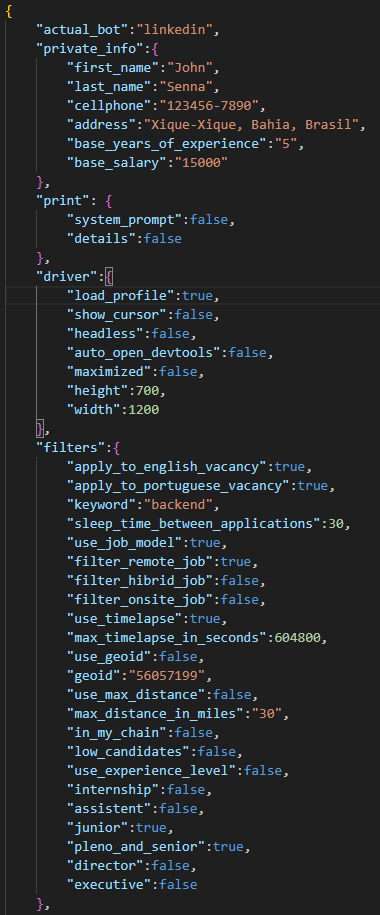
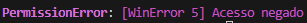
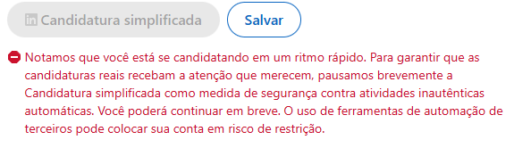
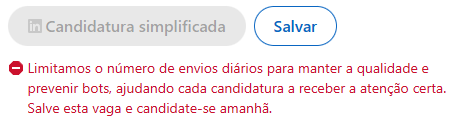

### Preview

  

### Configurável



### Apoie o Projeto ☕
  
Por favor, não hesite em colaborar com o projeto. Deixe sua ⭐  
  
| Rede | Ícone | Endereço |
| :--- | :---: | :--- |
| **Bitcoin** |  | `bc1qg6ava2w08d5k2588edylj08ux4yuhn74yygsnr` |
| **Ethereum** |  | `0xcD36cf511646bD39Cb23f425786a4f3699CcFD2a` |
| **Solana** |  | `FKotLMzTKNbdZcKXkXsPuP1hcXGiXfScjB7qvSCQAev2` |
| **BNB Chain** |  | `0xcD36cf511646bD39Cb23f425786a4f3699CcFD2a` |
| **TRON** |  | `TWhZLJ61uY1bo8zicwhnfS5NKuuD6BJ8D8` |

### Build BETA
  
Tentarei gerar um executável com python e todos os drivers embutidos em breve, assim que tivermos uma versão estável.  
  
### Quickstart
  
- [Ollama](https://ollama.com/) instalado
- GPU capaz de rodar o modelo **gemma3:4b** (é possivel alterar o modelo nas options.json)
- [python 3](https://www.python.org/ftp/python/3.14.2/python-3.14.2-amd64.exe) instalado
- opcional: crie uma venv
- crie a pasta **bin** na raiz do projeto
- Baixe o [chrome for testing](https://googlechromelabs.github.io/chrome-for-testing/#stable) **win64** e extraia para a pasta bin
- rode o comando ```pip install -r requirements.txt``` para instalar dependências
- a versão do **chrome for testing** e do **undetected chromedriver** devem ser idênticas. Você pode verificar a versão do **undetected chromedriver** em **"%AppData%\undetected_chromedriver\undetected_chromedriver.exe"** abrindo as propriedades do executável e visualizando a aba 'detalhes'
- abra o terminal na raiz do projeto e rode o comando ```python main.py```

### Erros
  
Se você estiver obtendo o erro  
  
rode o arquivo **fix_issue.bat** e tente reiniciar o computador.  

### About
    
Nos últimos dias meu feed foi invadido pela propaganda do vaga automatica.  
Vi que tinham muitas reclamações no reclameaqui além de cobraram no mínimo R$100, então decidi fazer minha própria ferramenta.  
Trata-se de um bot para automatizar candidatura a vagas de emprego no linkedin.  
Na primeira execucão o bot espera que você faça login para continuar a funcionar.  
Seu linkedin deve possuir apenas dois curriculos, um em portugues e outro em ingles, com os respectivos nomes: **INGLES.pdf** e **PORTUGUES.pdf**  
Modifique seus curriculos aqui: https://www.linkedin.com/jobs/application-settings/  
O bot seleciona o curriculo de acordo com a linguagem da vaga, e precisa que eles tenham esse nomes para selecionar corretamente.  
configure o **options.json** como desejar.  
  
Observação: o driver deve ficar focado para melhor funcionamento, acredito que ocorrem falhas se ficar minimizado mas não testei.  
  
  
  
após rigorosos testes obtive esse problema, então adicionei um sleep de 30 segundos entre candidaturas configuravel.  
  
  
  
Existe um limite de candidaturas que podem ser enviadas.  

### TODO

- cursor movido por RNN [mouse-ai](https://github.com/SaluRamos/mouse-ai)
- a parte de preencher input é suscetível a falhas, é preciso refino. Não encontrei uma maneira de descobrir oque o field espera (numeric or string)
- SendKeys digitando igual humano + navegação completa por mouse
- suportar curriculo em espanhol
- suporte ao site Indeed
- suporte ao site Gupy
